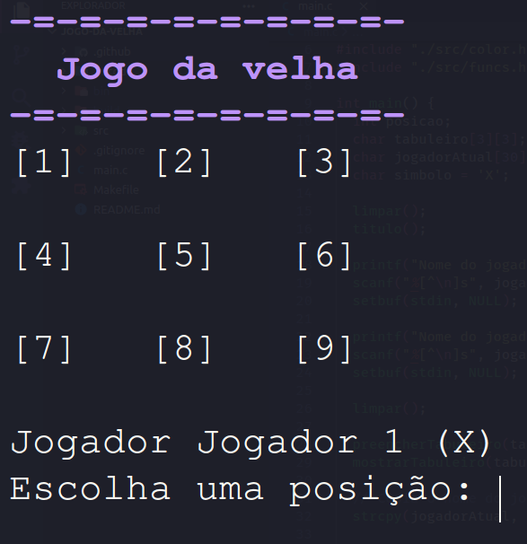

# Jogo da velha feito em C




Projeto realizado para a disciplina de Programação Estruturada do curso de Ciência da Computação do IFCE - Campus Iguatu.

Feito por [@sandenbergmelo](https://github.com/sandenbergmelo) e [@marcusxv14](https://github.com/marcusxv14)

### Para compilar use o comando `make` na raiz do projeto.
### Para executar use o comando `make run` na raiz do projeto.
---
### Para instalar o make:
#### Debian/Ubuntu:
```sh
sudo apt install make
```
#### Fedora:
```sh
sudo dnf install make
```
#### Arch:
```sh
sudo pacman -S make
```
### Windows:
[Instale o GnuWin](http://gnuwin32.sourceforge.net/packages/make.htm)
